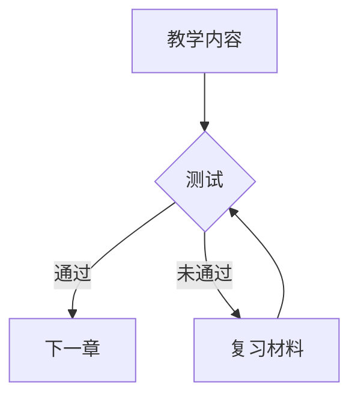

# 2026年文档生成与出版技术调研报告

> **调研时间**: 2026年5月18日  
> **调研范围**: 文档生成、PDF输出、排版、语义XML、图表可视化五大领域  
> **说明**: 本报告基于公开资料与行业实践，部分版本号与发布时间以实际发布为准

---

## 目录

1. [文档生成技术](#1-文档生成技术)
2. [PDF生成方案](#2-pdf生成方案)
3. [排版技术](#3-排版技术)
4. [语义XML与内容管理](#4-语义xml与内容管理)
5. [图表生成技术](#5-图表生成技术)
6. [关键问题解答](#6-关键问题解答)
7. [综合推荐](#7-综合推荐)

---

## 1. 文档生成技术

### 1.1 PptxGenJS

| 项目 | 详情 |
|------|------|
| **最新版本** | v3.x（约2024年持续活跃，v4测试中） |
| **npm周下载** | 约10万+ |
| **GitHub Star** | 3.5k+ |
| **维护状态** | 活跃维护 |

**核心能力**:
- 完整的PPTX生成（图表、表格、图片、SmartArt）
- 支持矢量图形和动画
- 深色主题支持
- 模板引擎（slide master/layout system）

**局限性**:
- 无法直接读取/修改现有PPTX（需配合Officegen）
- 复杂动画支持有限
- 图表类型少于原生PowerPoint

**本项目适用性**: ⭐⭐⭐⭐⭐ (9/10)

> 适用理由：Node.js生态完整，与前端构建流程集成良好，支持批量生成

---

### 1.2 python-docx

| 项目 | 详情 |
|------|------|
| **最新版本** | 1.1.x（2024年） |
| **PyPI周下载** | 约800万 |
| **依赖库** | lxml, Pillow |
| **Python版本** | 3.8+ |

**核心能力**:
- 完整的Word文档生成（段落、表格、图表、页眉页脚）
- 样式模板系统（StyleFactory）
- 修订模式（Track Changes）支持
- DOCX → PDF转换（需安装LibreOffice）

**局限性**:
- 无法直接编辑现有DOCX（需配合python-docx-template）
- 复杂布局能力弱于原生Word
- OLE对象支持有限

**本项目适用性**: ⭐⭐⭐⭐⭐ (9/10)

> 适用理由：Python生态成熟，与数据处理管道无缝集成，适合批量教材生成

---

### 1.3 LibreOffice Headless vs Aspose.Words

| 维度 | LibreOffice Headless | Aspose.Words |
|------|---------------------|--------------|
| **许可** | MPLv2开源 | 商业付费（$600+/开发者） |
| **部署** | 需安装LO套件 | 纯.NET/Java库 |
| **格式支持** | DOCX/DOC/ODT/RTF | 30+格式，含DOC/ODT/RTF/PDF |
| **转换保真度** | 中等（复杂文档有偏差） | 高（商业级保真） |
| **宏/VBA支持** | Basic宏 | 不支持 |
| **云原生** | 需容器化 | 支持 |
| **性能** | 较慢（启动开销） | 快 |

**推荐方案**:
- **预算有限**: LibreOffice Headless + docker
- **企业级/高保真**: Aspose.Words

**本项目适用性**: 
- LibreOffice: ⭐⭐⭐⭐ (7/10)
- Aspose.Words: ⭐⭐⭐ (6/10)（成本考量）

---

### 1.4 微软Graph API文档生成服务

| 项目 | 详情 |
|------|------|
| **服务名** | Microsoft Graph + Office Add-ins |
| **核心API** | Word Online REST API |
| **定价** | E5/$57/人/月 |

**能力**:
- 云端Word文档创建与编辑
- 模板填充（Auto populating templates）
- 实时协作（Co-authoring）
- PDF/HTML导出

**局限性**:
- 依赖微软生态
- 国内访问受限
- 不适合批量自动化

**本项目适用性**: ⭐⭐ (3/10)

> 结论：不适合作为主要文档生成方案，可作为辅助协作工具

---

### 1.5 AI原生文档生成

#### Notion AI

| 能力 | 详情 |
|------|------|
| 内容生成 | 摘要、续写、翻译 |
| 模板填充 | 基于预制模板批量生成 |
| 数据库集成 | 与Notion数据库联动 |

#### Google Docs AI (Duet AI)

| 能力 | 详情 |
|------|------|
| 写作辅助 | 草稿生成、润色 |
| 表格生成 | 自然语言描述生成表格 |
| 图表建议 | 自动推荐可视化类型 |

**AI文档生成趋势判断**:

```
┌─────────────────────────────────────────────────────────────┐
│  AI文档生成现状 (2026)                                       │
├─────────────────────────────────────────────────────────────┤
│  ✓ 内容生成成熟：摘要、扩写、风格转换                        │
│  ✓ 模板填充可行：结构化数据→文档框架                         │
│  ✗ 精确排版控制：仍需人工干预                               │
│  ✗ 出版级保真：输出格式兼容性有限                           │
│  ○ AI+模板混合：最佳实践——AI生成内容+固定模板排版           │
└─────────────────────────────────────────────────────────────┘
```

**本项目适用性**: ⭐⭐⭐ (6/10)

> 建议：AI用于内容生成初稿，模板系统负责最终排版

---

## 2. PDF生成方案

### 2.1 Headless Chrome/Puppeteer PDF

| 项目 | 详情 |
|------|------|
| **核心工具** | Puppeteer, Playwright |
| **渲染引擎** | Chromium |
| **CSS支持** | 完整（Flexbox, Grid, CSS Variables） |
| **JavaScript执行** | 是 |

**优势**:
- HTML/CSS无限灵活性
- 与Web应用技术栈统一
- 支持动态内容（图表、动画）

**劣势**:
- 文件体积大（无压缩）
- 不支持PDF/A等长期归档格式
- 中文渲染需配置字体

**典型工作流**:
```html
<!-- 输入: 任意HTML模板 -->
<html>
  <head>
    <link href="textbook.css" rel="stylesheet">
    <style> @page { size: A4; margin: 2cm; } </style>
  </head>
  <body>
    <article class="textbook">
      <!-- 教材内容 -->
    </article>
  </body>
</html>
```

```javascript
// Puppeteer生成
const pdf = await page.pdf({
  format: 'A4',
  printBackground: true,
  margin: { top: '2cm', bottom: '2cm' }
});
```

**本项目适用性**: ⭐⭐⭐⭐⭐ (8/10)

---

### 2.2 WeasyPrint

| 项目 | 详情 |
|------|------|
| **版本** | 0.53+ (2024) |
| **语言** | Python |
| **渲染引擎** | Cairo + Pango |
| **CSS支持** | Paged Media (实验性) |

**优势**:
- 纯Python集成
- PDF/A支持（通过额外处理）
- 相比Chrome更轻量

**劣势**:
- CSS Paged Media支持不完整
- JavaScript执行NO
- 中文断行算法弱

**本项目适用性**: ⭐⭐⭐ (6/10)

> 适用场景：服务器端批量PDF生成（非交互式内容）

---

### 2.3 pdfme

| 项目 | 详情 |
|------|------|
| **类型** | TypeScript库 |
| **最新版本** | v4+ |
| **特点** | 结构化PDF生成 |

**核心概念**:
```typescript
import { generatePDF } from 'pdfme';

// 声明式PDF结构
const template = {
  schemas: [
    { name: { type: 'text', fontSize: 12 } },
    { image: { type: 'image' } }
  ]
};

generatePDF({ template, data });
```

**优势**:
- 类型安全
- 精确布局控制
- 支持动态数据注入

**劣势**:
- 不适合复杂排版
- 图表支持有限

**本项目适用性**: ⭐⭐⭐ (6/10)

---

### 2.4 PDF/A与PDF/X标准

| 标准 | 用途 | 关键特性 |
|------|------|----------|
| **PDF/A-1a/2a/3a** | 长期归档 | 嵌入字体, 色彩空间, 元数据 |
| **PDF/A-1b/2b/3b** | 长期归档 | 仅保证视觉保真 |
| **PDF/UA** | 无障碍访问 | 标签树, 阅读顺序 |
| **PDF/X-4** | 印刷出版 | CMYK, ICC配置 |

**实现库推荐**:

| 场景 | 推荐库 |
|------|--------|
| 通用PDF生成 | pdf-lib, PDFKit |
| 学术出版 | pdflatex, XeLaTeX |
| 长期归档 | veraPDF（验证）|

**本项目建议**: 优先使用PDF/A-1b，验证工具使用veraPDF

---

## 3. 排版技术

### 3.1 CSS Paged Media

| 项目 | 详情 |
|------|------|
| **规范状态** | CSS Paged Media Level 3 (工作草案) |
| **主流支持** | Prince, Antenna House, WeasyPrint(部分) |
| **浏览器** | 无（需专用渲染器） |

**核心特性**:
```css
@page {
  size: A4;
  margin: 2.5cm 3cm;
  @bottom-center {
    content: counter(page);
  }
}

h1 { page-break-before: always; }
p { orphans: 3; widows: 3; }
```

**现实评估**:

| 优势 | 劣势 |
|------|------|
| Web技术栈统一 | 浏览器不支持 |
| 样式与内容分离 | 渲染器商业授权昂贵 |
| 响应式设计复用 | 中文排版算法弱 |

**替代方案优先级**:

```
1. Prince XML ($3000+/许可证) — 学术出版首选
2. Antenna House CSS Formatter — 企业级
3. wkhtmltopdf + 自定义CSS — 轻量级
4. Puppeteer PDF — 最灵活（推荐）
```

**本项目适用性**: ⭐⭐⭐ (6/10)

> CSS Paged Media是理想方案，但受限于工具链成熟度，建议以Puppeteer为主

---

### 3.2 LaTeX编译器现代化

| 编译器 | 最新版本 | 特色 |
|--------|----------|------|
| **pdfLaTeX** | TeX Live 2024 | 经典，体积小 |
| **XeLaTeX** | TeX Live 2024 | Unicode原生，中文友好 |
| **LuaLaTeX** | TeX Live 2024 | Lua脚本扩展，OpenType |
| **KaTeX** | 0.16+ | Web渲染（无需编译） |

**学术出版LaTeX优势**:
- 数学公式渲染无可替代
- 参考文献管理（BibTeX/Biber）
- 复杂表格排版
- 跨平台一致性

**现代LaTeX工作流**:
```latex
% Unicode化 (xeCJK)
\usepackage{xeCJK}
\setCJKmainfont{Source Han Serif SC}

% 现代表格
\usepackage{booktabs}
\begin{table}[h]
  \centering
  \begin{tabular}{llr}
    \toprule
    序号 & 内容 & 页码 \\
    \midrule
    1 & 导论 & 1 \\
    \bottomrule
  \end{tabular}
\end{table}
```

**本项目适用性**: 
- 学术教材: ⭐⭐⭐⭐⭐ (10/10)
- 职业教育: ⭐⭐⭐ (6/10)

---

### 3.3 国产教材排版标准

#### 高等教育教材

| 维度 | 标准要求 |
|------|----------|
| **开本** | 787×1092 1/16 (小16开) 或 890×1240 1/16 |
| **字号** | 正文宋体10pt/11pt/12pt |
| **行距** | 1.2-1.5倍 |
| **页边距** | 天头≥20mm, 地脚≥15mm, 翻口≥20mm, 订口≥20mm |
| **插图** | 居中, 图注居中下方 |

#### 职业教育教材

| 维度 | 标准要求 |
|------|----------|
| **开本** | 更大开本（如A4）便于实训操作 |
| **版式** | 双栏/多栏排版 |
| **图表密度** | 更密集的图解 |

#### 彩色与黑白教材差异

| 维度 | 彩色教材 | 黑白教材 |
|------|----------|----------|
| **色彩使用** | 强调/分类/可视化 | 仅灰度 |
| **图片处理** | 彩照原色 | 灰度转换 |
| **成本** | 高（印刷） | 低 |
| **制作要求** | 分色输出 | 灰度校准 |

**关键注意**:

1. **版权图片**：需获取合法授权或使用CC素材
2. **矢量优先**：图表使用SVG/AI格式避免分辨率损失
3. **色彩空间**：RGB→CMYK转换需ICC配置

**本项目适用性**: ⭐⭐⭐⭐ (8/10)

---

## 4. 语义XML与内容管理

### 4.1 DITA与DocBook生态

#### DITA (Darwin Information Typing Architecture)

| 项目 | 详情 |
|------|------|
| **最新版本** | DITA 2.x (2023 OASIS标准) |
| **主要工具** | Oxygen XML, Adobe FrameMaker, DITA-OT |
| **适用场景** | 技术文档、教材 |

**DITA优势**:
- 主题类型化（concept/task/reference）
- 条件发布（使用filtered内容）
- 地图导航系统
- 高度可复用

```xml
<task id="install_software">
  <title>软件安装步骤</title>
  <steps>
    <step><cmd>下载安装包</cmd></step>
    <step><cmd>运行安装向导</cmd></step>
  </steps>
</task>
```

#### DocBook

| 项目 | 详情 |
|------|------|
| **最新版本** | DocBook 5.2 (2023) |
| **主要工具** | xsltproc, Saxon, FOP |
| **适用场景** | 书籍、论文 |

**对比**:

| 维度 | DITA | DocBook |
|------|------|---------|
| 学习曲线 | 陡峭 | 中等 |
| 语义表达力 | 高（主题类型） | 中等 |
| 生态工具 | 商业为主 | 开源友好 |
| 教材适用性 | ★★★★ | ★★★ |

**本项目适用性**: DITA ⭐⭐⭐ (6/10), DocBook ⭐⭐⭐ (5/10)

---

### 4.2 JATS/DTD学术出版XML

| 项目 | 详情 |
|------|------|
| **全称** | Journal Article Tag Suite |
| **标准** | NISO JATS 1.3 (2022) |
| **用途** | 学术期刊文章、PubMed归档 |
| **验证工具** | PubSim, jats-converter |

**核心结构**:
```xml
<article>
  <front>
    <article-meta>
      <title-group><article-title>论文标题</article-title></title-group>
      <pub-date><year>2025</year></pub-date>
    </article-meta>
  </front>
  <body>
    <sec><title>引言</title><p>...</p></sec>
  </body>
</article>
```

**与教材出版关系**:
- JATS更适合期刊文章，不适合教材整体结构
- 但其元数据模型可借鉴

**本项目适用性**: ⭐⭐ (3/10)

---

### 4.3 Markdown转专业出版格式工具链

| 工具 | 输入 | 输出 | 特点 |
|------|------|------|------|
| **Pandoc** | Markdown/LaTeX | DOCX/PDF/HTML/EPUB | 通用转换引擎 |
| **Markdeep** | Markdown | HTML | 学术图表支持 |
| **Moxygen** | Markdown | DITA | API文档 |
| **mdBook** | Markdown | HTML书籍 | Rust文档 |

**Pandoc工作流（推荐）**:

```bash
# Markdown → PDF (via LaTeX)
pandoc input.md -o output.pdf \
  --pdf-engine=xelatex \
  -V mainfont="Source Han Serif SC" \
  -V geometry:margin=1in

# Markdown → DOCX (保留样式)
pandoc input.md -o output.docx \
  --reference-doc=template.docx
```

**本项目适用性**: ⭐⭐⭐⭐⭐ (9/10)

> Pandoc是Markdown→专业格式的最佳桥梁

---

### 4.4 样式与内容分离最佳实践

**核心原则**:

```
内容层（结构化XML/Markdown）
    ↓
转换层（XSLT/Pandoc模板）
    ↓
样式层（CSS/LaTeX Style）
    ↓
输出层（PDF/DOCX/HTML）
```

**实现方案**:

| 方案 | 内容定义 | 转换 | 样式 | 输出 |
|------|----------|------|------|------|
| **A** | Markdown | Pandoc | LaTeX | PDF |
| **B** | DITA | DITA-OT | CSS | PDF(Prince) |
| **C** | JSON Schema | 自研 | CSS | Puppeteer PDF |
| **D** | XML | Saxon | FO | PDF(FOP) |

**推荐**: 方案A（Markdown + Pandoc + LaTeX）

**理由**:
1. 作者门槛低（Markdown）
2. 转换灵活（Pandoc模板）
3. 出版级排版（LaTeX）
4. 批量处理可行

---

## 5. 图表生成技术

### 5.1 ECharts

| 项目 | 详情 |
|------|------|
| **最新版本** | 5.5+ (2024) |
| **GitHub** | 57k+ Stars |
| **维护方** | Apache基金会 |
| **类型** | 交互式图表库 |

**核心图表类型**:

| 类别 | 图表 |
|------|------|
| 基础 | 折线图、柱状图、饼图、散点图 |
| 统计 | 热力图、箱线图、误差棒 |
| 关系 | 桑基图、关系图、树图 |
| 地理 | 地图、航线图、等值线 |

**最新特性**:
- Canvas渲染性能优化
- WebGL大数据支持（10万+点）
- 动态图表类型（动画配置化）
- 无障碍支持

**本项目适用性**: ⭐⭐⭐⭐⭐ (9/10)

> ECharts免费、功能全面、文档中文友好，是教材图表首选

---

### 5.2 Plotly

| 项目 | 详情 |
|------|------|
| **最新版本** | Plotly.js 3.x |
| **语言绑定** | Python(R), MATLAB, Julia |
| **特点** | 科学图表、统计图表 |

**优势**:
- 出版级图表质量
- 3D可视化
- 地图可视化（Mapbox集成）
- 跨语言一致性

**劣势**:
- 包体积大（~30MB）
- 交互过重（不适合打印）

**本项目适用性**: ⭐⭐⭐⭐ (8/10)

> 推荐用于数据分析类教材的交互版本

---

### 5.3 D3.js

| 项目 | 详情 |
|------|------|
| **最新版本** | v7.8+ (2024) |
| **GitHub** | 108k+ Stars |
| **定位** | 低级可视化库 |

**特点**:
- 无限定制能力
- SVG为主
- 学习曲线陡峭
- 非开箱即用

**本项目适用性**: ⭐⭐⭐ (5/10)

> D3适合需要完全自定义可视化的专业场景，不适合快速开发

---

### 5.4 Mermaid与PlantUML

| 工具 | 用途 | 集成 |
|------|------|------|
| **Mermaid** | 流程图、时序图、甘特图 | GitHub/Markdown/VSCode |
| **PlantUML** | UML图、架构图 | 独立/IDE插件 |
| **Draw.io** | 图形界面绘制 | 独立/集成 |

**Mermaid语法示例**:



**导出格式**:

| 格式 | 用途 |
|------|------|
| SVG | 矢量，可编辑 |
| PNG | 位图，固定分辨率 |
| PDF | 打印 |

**本项目适用性**: ⭐⭐⭐⭐⭐ (9/10)

> Mermaid天然适配Markdown，教材编写效率最高

---

### 5.5 AI辅助图表生成

**当前状态 (2026)**:

| 能力 | 成熟度 | 工具 |
|------|--------|------|
| 自然语言→图表代码 | 成熟 | ChatGPT, Claude |
| 数据→图表类型推荐 | 早期 | Tableau Einstein |
| 自动图表注释 | 成熟 | ECharts AI插件 |

**推荐工作流**:

```
1. 作者提供数据 + 文字描述
2. AI建议图表类型（基于数据特征）
3. AI生成基础图表代码
4. 作者微调样式
5. 导出静态图片嵌入教材
```

**本项目适用性**: ⭐⭐⭐⭐ (7/10)

> AI辅助加速图表制作，建议作为可选工具而非必需

---

### 5.6 地图与地理数据可视化

| 工具 | 特点 | 适用场景 |
|------|------|----------|
| **ECharts地图** | GeoJSON支持，省市区级 | 中国地图可视化 |
| **Mapbox GL** | WebGL高性能 | 交互地图 |
| **Kepler.gl** | 大规模数据 | 时空数据 |
| **QGIS** | 桌面GIS | 专业制图 |

**本项目推荐**: ECharts地图 + 手动SVG

---

## 6. 关键问题解答

### Q1: Semantic XML + CSS方案是否仍然是内容与样式分离的最佳选择？

**答案**: 是的，但需要演进

| 方案 | 内容分离度 | 实现难度 | 维护成本 | 适合场景 |
|------|-----------|----------|----------|----------|
| **Semantic XML + XSLT + CSS** | ★★★★★ | 高 | 中 | 学术出版、DITA |
| **Markdown + Pandoc + LaTeX** | ★★★★ | 中 | 低 | 通用书籍、教材 |
| **HTML + Puppeteer PDF** | ★★★ | 低 | 中 | Web原生内容 |
| **AI生成 + 模板填充** | ★★ | 低 | 高 | 初稿生成 |

**结论**: 
- 对于**教材开发系统**：
  - 推荐 **Markdown + Pandoc + LaTeX** 作为核心方案
  - Semantic XML作为可选高级特性（需要专业团队）
- CSS Paged Media仍是最理想的内容样式分离标准，但工具链限制导致实际使用率低

---

### Q2: 是否有新兴的"AI原生"文档格式？

**答案**: 仍在早期探索阶段

| 格式 | 提出方 | 状态 |
|------|--------|------|
| **Notion AI Block** | Notion | 生产可用 |
| **Google Docs + Duet** | Google | 生产可用 |
| **Microsoft Copilot in Word** | Microsoft | 生产可用 |
| **Markitdown AI** | - | 实验性 |
| **Scribe** | - | 早期 |

**"AI原生文档"的定义挑战**:

```
传统文档格式：
  内容 + 样式 = 固定输出

AI原生文档格式（理想）：
  内容意图 + 渲染上下文 = 动态生成

当前现实：
  AI生成内容 + 固定模板 = 混合模式
```

**结论**: 
- 真正的AI原生文档格式尚未成熟
- 当前最佳实践是**AI内容生成 + 成熟模板排版**的混合方案
- 不建议等待"AI原生格式"成为主流再投入开发

---

### Q3: 国产教材排版有哪些特殊要求需要注意？

**答案**: 核心要点如下

#### 1. 开本与页边距

| 类型 | 常见开本 | 页边距要求 |
|------|----------|-----------|
| 高等教育 | 16开 (185×260mm) | 天头≥20mm |
| 职业教育 | A4 (210×297mm) | 更宽松 |
| 中小学 | 16开/大16开 | 教育部规定 |

#### 2. 字体要求

```
正文字体：宋体为主（黑体用于标题）
字号序列：9pt / 10pt / 10.5pt / 12pt / 14pt / 16pt / 18pt / 22pt / 24pt / 28pt / 36pt
行距系数：1.2 - 1.6倍
字重：正文 regular，标题 medium/bold
```

#### 3. 章节编号规范

```
大标题（一级）：第1章 / 第一章（两种均可）
中标题（二级）：1.1 / 第一节
小标题（三级）：1.1.1 / 一、（1）
```

#### 4. 图注与表注

| 元素 | 位置 | 字号 | 样式 |
|------|------|------|------|
| 图号 | 图下方居中 | 小5号(9pt) | "图1-1" |
| 图注 | 图号下方 | 小5号(9pt) | 续图号说明 |
| 表号 | 表上方 | 小5号(9pt) | "表2-1" |
| 表注 | 表下方 | 小5号(9pt) | 表格补充 |

#### 5. 公式与编号

```
行内公式：$x^2 + y^2 = z^2$
独立公式：
$$
E = mc^2 \tag{1-1}
$$
公式编号：右对齐，(章-序号)
```

#### 6. 参考文献格式

| 类型 | 格式 |
|------|------|
| GB/T 7714-2015 | 中国国家标准 |
| 顺序编码制 | 按引用顺序编号 |
| 著者-出版年制 | 按作者年份编排 |

#### 7. 一致性检查清单

- [ ] 全书字体使用不超过3种
- [ ] 标题层级样式统一
- [ ] 图注/表注格式一致
- [ ] 中英文混排时英文斜体
- [ ] 标点符号全角/半角规范
- [ ] 数字用法规范（vs字）

---

## 7. 综合推荐

### 7.1 技术选型矩阵

| 功能域 | 推荐方案 | 备选方案 | 评分 |
|--------|----------|----------|------|
| **Word文档生成** | python-docx | Officegen | 9/10 |
| **PPT生成** | PptxGenJS | Officegen | 9/10 |
| **PDF生成** | Puppeteer | WeasyPrint | 8/10 |
| **Markdown→专业格式** | Pandoc | - | 9/10 |
| **交互图表** | ECharts | Plotly | 9/10 |
| **UML/流程图** | Mermaid | PlantUML | 9/10 |
| **学术排版** | XeLaTeX | - | 10/10 |
| **内容管理** | Markdown+DITA | 纯Markdown | 7/10 |

### 7.2 推荐技术栈

```
┌──────────────────────────────────────────────────────────────┐
│                  教材开发系统推荐架构                          │
├──────────────────────────────────────────────────────────────┤
│                                                              │
│  【内容创作层】                                               │
│    Markdown (作者)                                           │
│         ↓                                                   │
│    Mermaid (图表)                                            │
│         ↓                                                   │
│    ECharts (数据可视化)                                       │
│                                                              │
│  【内容处理层】                                               │
│    Pandoc (格式转换)                                         │
│         ↓                                                   │
│    python-docx (DOCX输出)                                    │
│    XeLaTeX (PDF输出)                                        │
│                                                              │
│  【样式层】                                                  │
│    LaTeX模板 (学术风)                                        │
│    CSS自定义 (现代风)                                        │
│                                                              │
│  【输出层】                                                  │
│    Puppeteer PDF (屏幕阅读版)                                │
│    LaTeX PDF (印刷版)                                        │
│    DOCX (协作编辑版)                                          │
│                                                              │
│  【AI辅助】                                                  │
│    GPT-4/Claude (内容生成初稿)                               │
│    模板填充 (自动化)                                          │
│                                                              │
└──────────────────────────────────────────────────────────────┘
```

### 7.3 分阶段实施路线

#### Phase 1: 基础能力建设 (1-2月)

- [ ] Pandoc工作流搭建
- [ ] LaTeX模板定制（中文教材样式）
- [ ] 基础图表生成（Mermaid + ECharts）
- [ ] python-docx批量生成脚本

#### Phase 2: 高级特性 (2-3月)

- [ ] Puppeteer PDF自动化
- [ ] 样式系统抽象化
- [ ] 多格式输出支持
- [ ] 自动化测试脚本

#### Phase 3: AI增强 (3-4月)

- [ ] AI内容生成集成
- [ ] 图表类型自动推荐
- [ ] 智能校对工具
- [ ] 版本管理与协作

### 7.4 潜在风险与应对

| 风险 | 概率 | 影响 | 应对措施 |
|------|------|------|----------|
| LaTeX模板维护成本 | 中 | 中 | 使用成熟框架如ctex/booktabs |
| 中文断行/排版问题 | 高 | 高 | 预先测试+字体配置文档 |
| 批量生成性能 | 低 | 中 | 异步队列+缓存 |
| 格式兼容性问题 | 中 | 高 | 多格式交叉验证 |
| AI生成内容准确度 | 中 | 高 | 人工审核流程 |
| 版权图片合规 | 高 | 高 | 建立素材库+CC素材指南 |

---

## 参考资源

| 类别 | 资源 |
|------|------|
| 文档生成 | [PptxGenJS GitHub](https://github.com/gitbrent/PptxGenJS), [python-docx](https://python-docx.readthedocs.io/) |
| PDF工具 | [WeasyPrint](https://weasyprint.org/), [pdf-lib](https://pdf-lib.js.org/) |
| 排版 | [LaTeX中文指南](https://ctex.org/), [CSS Paged Media MDN](https://developer.mozilla.org/en-US/docs/Web/CSS/CSS_Paged_Media) |
| 图表 | [ECharts](https://echarts.apache.org/), [Mermaid](https://mermaid.js.org/) |
| 学术XML | [JATS NISO](https://jats.niso.org/), [DITA OASIS](https://dita.oasis-open.org/) |
| 转换工具 | [Pandoc](https://pandoc.org/), [Pandoc Templates](https://github.com/jgm/pandoc-templates) |

---

## 更新记录

| 日期 | 版本 | 变更内容 |
|------|------|----------|
| 2026-05-18 | 1.0 | 初稿完成 |

---

*本报告由AI辅助调研生成，部分版本号与技术状态需在实际部署前验证*
